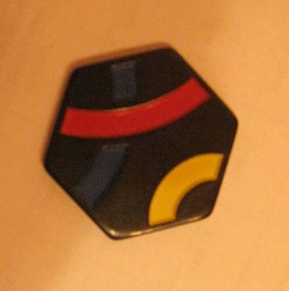
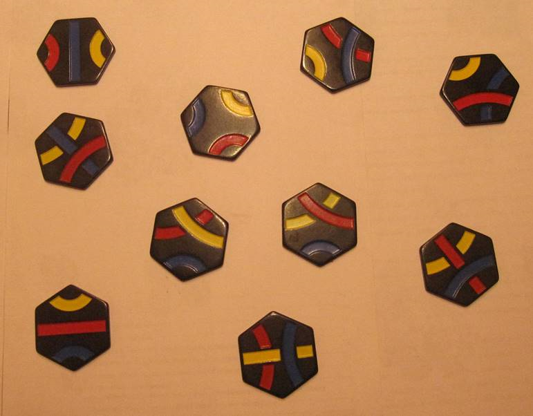

# Задание
Разработать и реализовать программу для работы с изображений фишек игрового набора Тантрикс, обеспечивающую:
* Ввод и отображение на экране изображений в формате BMP;
* Сегментацию изображений на основе точечных и пространственных
преобразований;
* Генерацию признаковых описаний фишек на изображении;
* Классификацию отдельных фишек.

Игровой набор Тантрикс состоит из десяти фишек, представленных на рисунке:

Каждая фишка представляет собой правильный шестиугольник черного цвета, на котором
изображены сегмент трёх линий синего, красного и жёлтого цветов.
Задача состоит в распознавании фишек, представленных на изображении. Нужно
разработать и реализовать алгоритм, входом которого является изображение, а выходом –
описание состава и расположения фишек.
 Для отладки и обучения алгоритма к заданию прилагаются 24 изображения различной
сложности. Сложность определяется количеством и взаимным расположением фишек. В
простых случаях изображены одиночные фишки, более сложные картинки содержат
несколько несоприкасающихся фишек.
  Примеры входных изображений представлены на рисунках. Это могут быть картинки с
изображением одной фишки.

Более сложные изображения включают группы из нескольких фишек, расположенных
произвольно:

##Класс Intermediate:
 1. Определить номер фишки. Вход – файл типа Single_*.bmp.
 2. Определить расположение и номера всех фишек в кадре. Вход – файл типа
Group_*.bmp.
