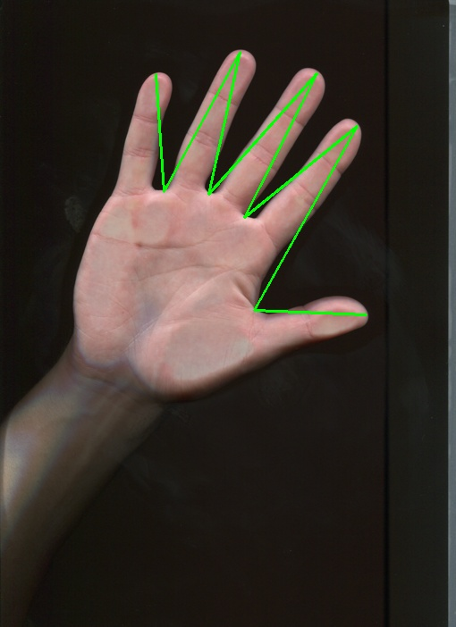

# Лабораторная работа № 2
## Задание
Разработать и реализовать программу для классификации изображений ладоней,
обеспечивающую:
- Ввод и отображение на экране изображений в формате TIF;
- Сегментацию изображений на основе точечных и пространственных
преобразований;
- Генерацию признаковых описаний формы ладоней на изображениях;
- Вычисление меры сходства ладоней;
- Кластеризацию изображений.

В качестве исходных данных прилагается набор из 99 цветных изображений ладоней
разных людей, полученных с помощью сканера, в формате 489×684 с разрешением 72 dpi.
Задача состоит в построении меры сходства изображений на основе выделения и анализа
формы ладоней. Нужно разработать и реализовать алгоритм, входом которого является
изображение, а выходом – описание признаков формы, попарные расстояния, кластеры
изображений.

Примеры входных изображений представлены на [рисунках](./training/).

В качестве признакового описания формы предлагается построить «линию пальцев» -
ломаную линию, соединяющую точки на кончиках пальцев (tips) с точками в основаниях
пальцев (valleys). Пример такой линии представлен на рисунке.
 

## Решение
### Среда разработки
Решение производилось на языке Python, с ипользованием библиотек:
- [opencv](http://opencv.org/) для считывания, сохранения, отображения изображений, применения фильтров к изображениям, поиска контуров, построения выпуклой оболочки и поиска её дефектов.
- [numpy](http://www.numpy.org/) для хранения изображений.
- [sklearn](http://scikit-learn.org/) для кластеризации изображений.
- [pandas](http://pandas.pydata.org/) для вывода результатов кластеризации в формат csv.
- [matplotlib](http://matplotlib.org/) для отображения графиков при поиске оптимального числа кластеров. 

### Описание алгоритма
- Считываются изображения в чёрно-белом формате для применения фильтра и цветом формате для отображения полученных преобразований
- Применяется [фильтр для выделения границ ладони](./Edges/)
- Выполняется [выделение всех границ на отфильтрованном изображении](./Contours_all/)
- Производится отсев лишних границ. Отбрасываются внешние контуры. Находится [контур ладони](./Contours_main/), как контур с наибольшей площадью из оставшихся. 
- 

## Результаты работы алгоритма
- [Фильтра для поиска границ ладони](./Edges/)
- [Все найденные контуры после применения фильтра](./Contours_all/)
- [Контуры ладони](./Contours_main/)
- [Линии между tips и valleys](./Result_lines/)
- [Кластеризация рук в формате (изображение, номер кластера)](./Clustering/)

